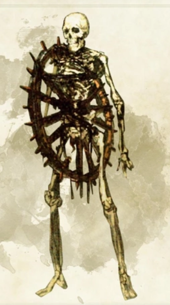

*Medium Undead, Evil*

Skeletons arise when animated by dark magic. They heed the summons of spellcasters who call them from their stony tombs and ancient battlefields, or rise of their own accord in places saturated with death and loss, awakened by stirrings of necromantic energy or the presence of corrupting evil.

When skeletons encounter living creatures, the necromantic energy that drives them compels them to kill unless they are commanded by their masters to refrain from doing so. They attack without mercy and fight until destroyed, for skeletons possess little sense of self and even less sense of self-preservation.

