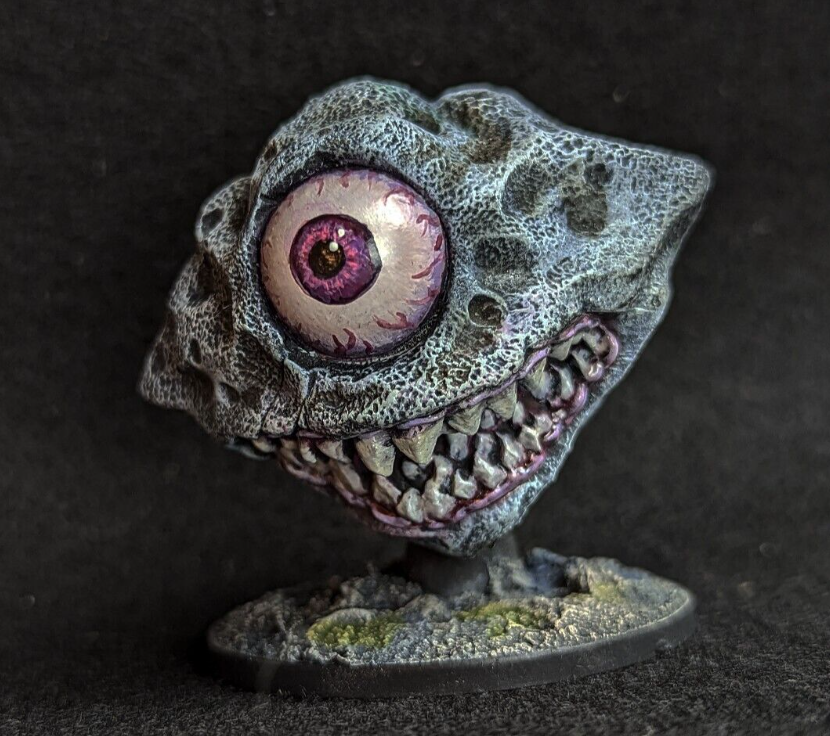

*Large Aberration, Evil*

When its large eye and mouth are closed, an eye monger looks like nothing more than a 12-foot-diameter asteroid. When it senses vibrations in the space around it, the eye monger opens its eye and reveals its true, menacing nature.
 
An eye monger has no use for treasure, but its belly might hold a fair amount of incidental valuables that it can’t digest, including coins, metal weapons, gemstones, and magic items that belonged to the creatures it swallowed.

Although an eye monger doesn’t project an antimagic cone from its eye as a beholder does, magic is suppressed inside its gullet, which prevents a swallowed creature from using magic to escape.

