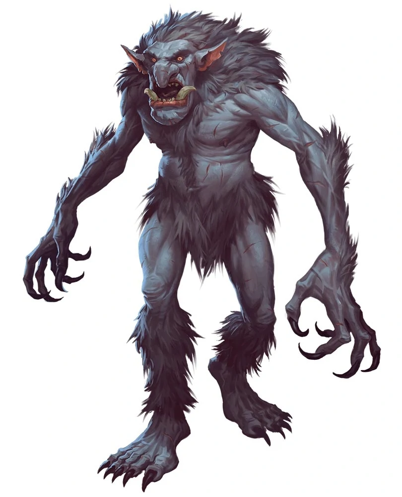

*Large Giant, Evil*

Born with horrific appetites, trolls eat anything they can catch and devour. They have no society to speak of, but they do serve as mercenaries to orcs, ogres, ettins, hags, and giants. As payment, trolls demand food and treasure. Trolls are difficult to control, however, doing as they please even when working with more powerful creatures.

