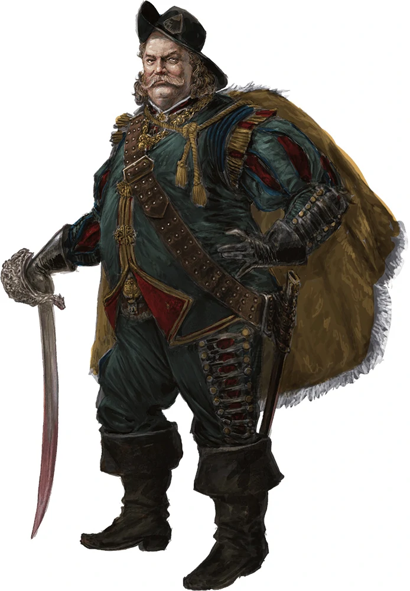

## Mirt

_Yawning Portal Factor - Waterdeep resident_

###### Description:
Mirt "the Moneylender" is a fat, wheezing old rogue and retired adventurer. He made his fortune as an adventurer in Undermountain after a colorful career as a mercenary general. During this time, Mirt—then known as Mirt the Merciless or the Old Wolf or Lord Walrus—made many enemies all over the Sword Coast, but also a few friends, notably [[Durnan]], a fellow adventurer and Undermountain explorer.
Mirt was also one of the most infamous factors of Waterdeep.[9]

