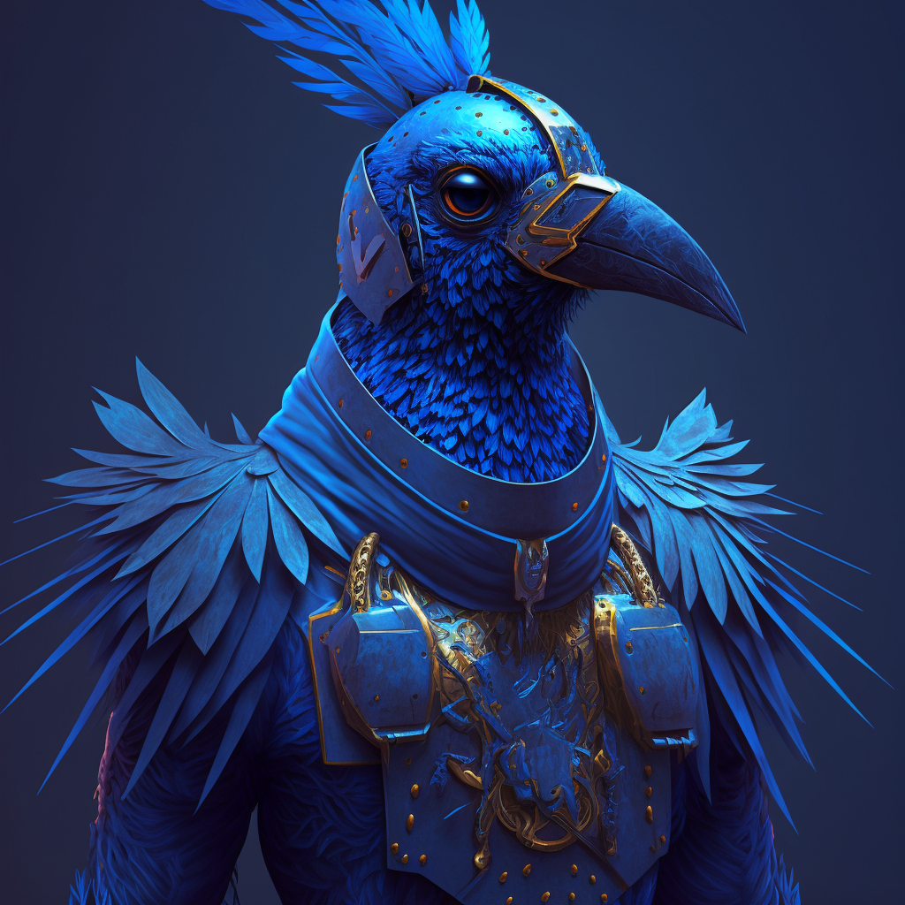

**Aarakocra:** *Medium Bird-like Humanoid, Neutral Good*

	(4) Blood Hunter: Order of the Ghost Slayer

	P. Percept: 12
	P. Investi: 12
	P. Insight: 12

	Lang: Aarakocra, Auran, Celestial, Common, Sylvan

	Feat: Duel Wielder

	Prof: Acrobatics, Athletics, Performance, Religion, Survival

	Magic Items: Breathing Bubble, Billowing Cloak

## Description
Standing tall at around five feet, this bird-like humanoid has a slender and agile build. Their feathers are a deep shade of blue that covers its entire body, giving it a sleek and regal appearance.

The eyes are milky white, and seem to glow with an inner light. They give off a wise and otherworldly quality, as if they are seeing beyond what is visible to others. Those close to Deekeek know this to be incorrect.

## Bio
Originally from X

Met up with the group 

Made a Pact with X to not steal shiny objects, trying to avoid bird like qualities.

## Notes
- Enjoys Shiny things
- Has made a pact to not steal said shiny things

### Class 
https://www.dndbeyond.com/classes/blood-hunter#OrderoftheGhostslayer

The Order of the Ghostslayer is the oldest of the blood hunter orders, its members having originally rediscovered the secrets of hemocraft and refined them for combat against the scourge of undeath. Ghostslayers seek out and study the moment of death, obsessing over the mystery of the transition from life, and the unholy power that can cause the dead to rise once more. These zealous blood hunters make it their life’s work to destroy the scourge of undeath wherever it is found, tuning their abilities to engage undead creatures and those who manipulate the necromancy that creates them.

### Race
https://www.dndbeyond.com/races/1026377-aarakocra

A winged people who originated on the Elemental Plane of Air, aarakocra soar through the sky wherever they wander. The first aarakocra served the Wind Dukes of Aaqa—mighty beings of air—and were imbued with a measure of their masters’ power over winds. Their descendants still command echoes of that power.

From below, aarakocra look like large birds and thus are sometimes called birdfolk. Only when they roost on a branch or walk across the ground is their Humanoid nature clear. Standing upright, aarakocra are typically about 5 feet tall, and they have long, narrow legs that taper to sharp talons. Feathers cover their bodies—usually red, orange, yellow, brown, or gray. Their heads are also avian, often resembling those of parrots or eagles.