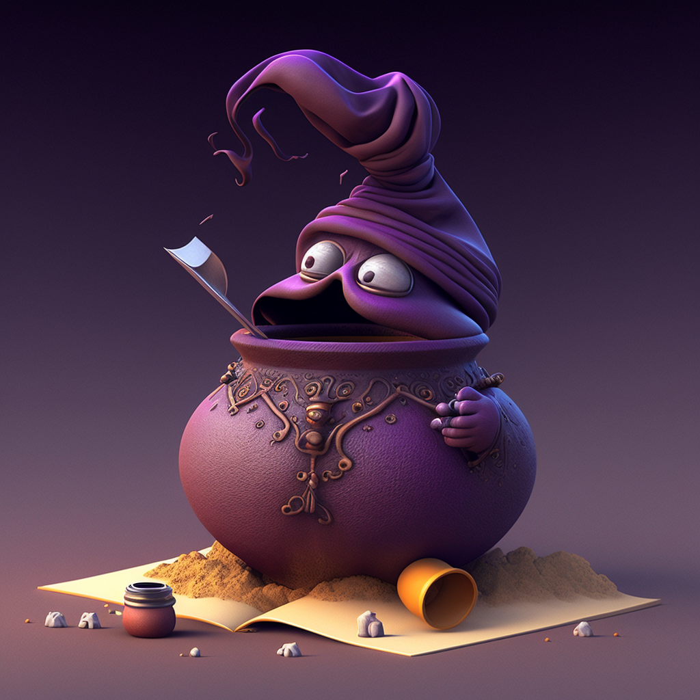
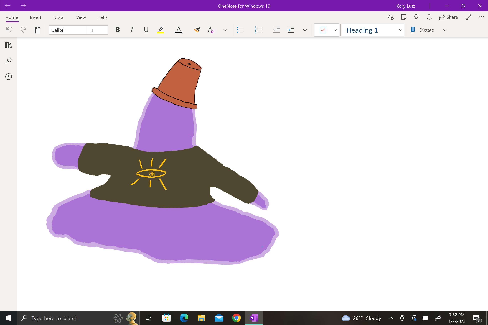

**Plasmoid**: *Medium Ooze, Chaotic Neutral*

	(1) Warlock: Pact of the Genie
	(2) Barbarian

	P. Percept: 9
	P. Investi: 9
	P. Insight: 9

	Lang: Abyssal, Celestial, Common, Undercommon

	Feat: Tavern Brawler

	Prof: Arcana, Athletics, History, Intimidation

### Description
https://www.dndbeyond.com/characters/91116630

Purple transparent ooze with items floating inside

### Class 
https://www.dndbeyond.com/classes/warlock#TheGenie

https://www.dndbeyond.com/classes/barbarian

You have made a pact with one of the rarest kinds of genie, a noble genie. Such entities rule vast fiefs on the Elemental Planes and have great influence over lesser genies and elemental creatures. Noble genies are varied in their motivations, but most are arrogant and wield power that rivals that of lesser deities. They delight in turning the table on mortals, who often bind genies into servitude, and readily enter into pacts that expand their reach.

### Race
https://www.dndbeyond.com/races/1121698-plasmoid

Plasmoids are amorphous beings with no typical shape. In the presence of other folk, they often adopt a similar shape, but there’s little chance of mistaking a plasmoid for anything else. They consume food by osmosis, the way an amoeba does, and excrete waste through tiny pores. They breathe by absorbing oxygen through another set of pores, and their limbs are strong and flexible enough to grasp and manipulate weapons and tools. Although most plasmoids are translucent gray, they can alter their color and translucence by absorbing dyes through their pores.

Plasmoids don’t have internal organs of the usual sort. Their bodies are composed of cells, fibers, plasma-like ooze, and clusters of nerves. These nerves enable a plasmoid to detect light, heat, texture, sound, pain, and vibrations. Plasmoids can stiffen the outer layers of their bodies to maintain a humanlike shape, so they can wear clothing and accessories. They speak by forcing air out of tubular cavities that constrict to produce sound.

When plasmoids sleep, they lose their rigidity and spread out and are thus sometimes mistaken for a rock or some other feature of the environment.