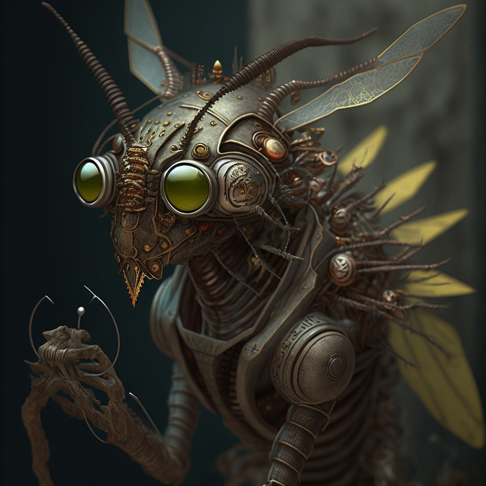

*Thri'keen: Small Humaniod, Lawful Neutral*

	(4) Artillerist Artificer

	P. Percept: 13
	P. Investi: 16
	P. Insight: 13

	Lang: Common, Telepathy, Thri-kreen

	Feat: Keen Mind

	Prof: Insight, Investigation, Perception, Sleight of Hand

	Magic Items: Clockwork Amulet, Mystery Key

## Description
Ka'Chow is a formidable and unique individual. This insectoid warrior has a chitinous exoskeleton that provides a natural armor, protecting them from harm. The color of the exoskeleton is a dark metallic grey, giving it a sleek and professional appearance.

Despite their imposing stature, the Artificer Mantis Warrior is surprisingly nimble, using their powerful legs and sharp claws to navigate both rugged terrain and urban environments with ease. They are highly skilled in combat, both with their natural weapons and with homemade machines, which they have a particular affinity for.

Ka'Chow is a mechanical genius, able to create and modify weapons with ease. They have a particular love for crafting and are often seen carrying an array of different tools, from planers to saws. They have an almost obsessive interest in perfecting their items and other tools, constantly tinkering with them and making improvements to their design.

## Bio
Originally from X

Found this mysterious key somewhere

Found enjoyment in woodworking

Met up with the group 

## Notes
- Interested in Locks and Keys
- Has a Key that he doesnt know about
- Has a small humunculi
- Enjoys Woodcrafting

### Description
https://www.dndbeyond.com/characters/91116630

### Class 
https://www.dndbeyond.com/classes/artificer#Artillerist

An Artillerist specializes in using magic to hurl energy, projectiles, and explosions on a battlefield. This destructive power is valued by armies in the wars on many different worlds. And when war passes, some members of this specialization seek to build a more peaceful world by using their powers to fight the resurgence of strife. The world-hopping gnome artificer Vi has been especially vocal about making things right: “It’s about time we fixed things instead of blowing them all to hell.”

### Race
https://www.dndbeyond.com/races/1121699-thri-kreen

Thri-kreen have insectile features and two pairs of arms. Their bodies are encased in protective chitin. They can alter the coloration of this carapace to blend in with their natural surroundings.

Although thri-kreen don’t sleep, they do require periods of inactivity to revitalize themselves. During these periods, they are fully aware of what’s happening around them.

Thri-kreen speak by clacking their mandibles and waving their antennae, indicating to other thri-kreen what they are thinking and feeling. Other creatures find this method of communication difficult to interpret and impossible to duplicate. To interact with other folk, thri-kreen rely on a form of telepathy.