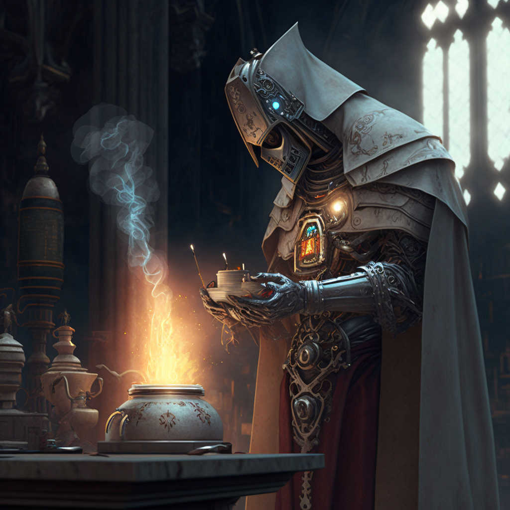

**Auto-Gnome**: *Small Construct, Lawful Neutral*

	(3) Sorcerer of the Divine Soul

	P. Percept: 11
	P. Investi: 11
	P. Insight: 13

	Lang: Celestial, Common, Elvish, Gnomish

	Feat: Metamagic Adept

	Prof: Arcana, History, Insight, Religion

	Magic Items: Ruby of the War Mage, Whisper Jar

## Description
Pobis is a unique and quirky individual, with a round and whimsical body made of gleaming metal and with a large gleeming red gem in their chest. Standing at just over two feet tall, this robot has a cheerful and energetic personality, always eager to try new things and experience the world around them.

Pobis is a quirky and lovable individual, programmed for greatness but struggling to reach their full potential. Despite their shortcomings, they remains determined and optimistic, never losing their love for flying and their thirst for knowledge. 

## Bio
Originally from X

Met up with the group 

## Notes
- Flys the Ship well

### Description
https://www.dndbeyond.com/characters/91116630

Green Gemstone Eyes

Steel colored metal skin

### Class 
https://www.dndbeyond.com/classes/sorcerer#DivineSoul

Sometimes the spark of magic that fuels a sorcerer comes from a divine source that glimmers within the soul. Having such a blessed soul is a sign that your innate magic might come from a distant but powerful familial connection to a divine being. Perhaps your ancestor was an angel, transformed into a mortal and sent to fight in a god’s name. Or your birth might align with an ancient prophecy, marking you as a servant of the gods or a chosen vessel of divine magic.

A Divine Soul, with a natural magnetism, is seen as a threat by some religious hierarchies. As an outsider who commands sacred power, a Divine Soul can undermine an existing order by claiming a direct tie to the divine.

In some cultures, only those who can claim the power of a Divine Soul may command religious power. In these lands, ecclesiastical positions are dominated by a few bloodlines and preserved over generations.

### Race
https://www.dndbeyond.com/races/1121695-autognome

Autognomes are mechanical beings built by rock gnomes. Sometimes, because of a malfunction or a unique circumstance, an autognome becomes separated from its creator and strikes out on its own.

An autognome bears a resemblance to its creator, and most autognomes are programmed to speak and understand Gnomish. The internal components used in an autognome’s manufacture can vary wildly; one autognome might have an actual beating heart in its chest cavity, while another might be powered by stardust or intricate clockwork gears.

Like gnomes, autognomes can live for centuries, typically up to 500 years.