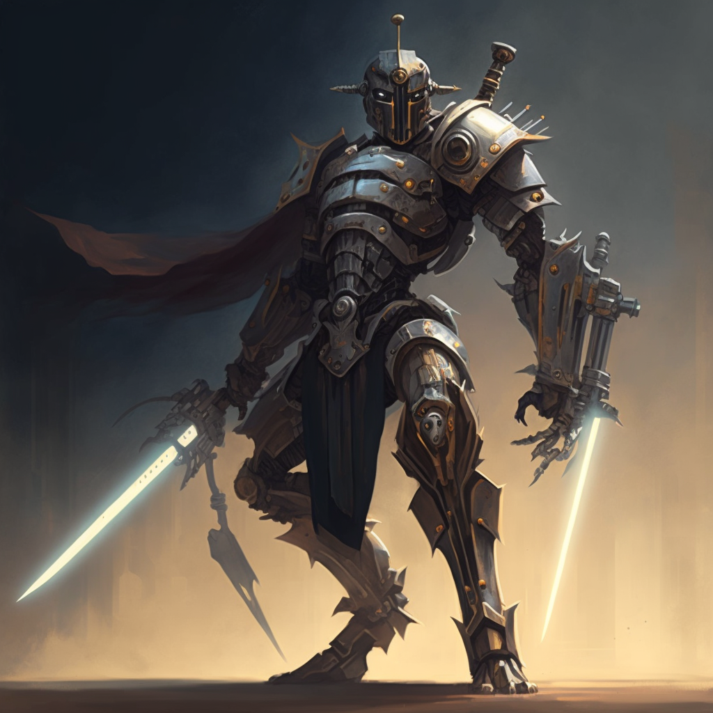

**Warforged**: *Medium Construct, Lawful Neutral*

	(3) Battlemaster Fighter

	P. Percept: 10
	P. Investi: 11
	P. Insight: 12

	Lang: Abanasinian, Common, Elvish, Istarian

	Feat: Magic Initiate (Cleric), Gunner

	Prof: Athletics, Insight, Intimidation, Religion, Survival

	Magic Items: Dread Helm, Pot of Awakening

## Description
Randy is a formidable and versatile warrior, with a body made of metal and wood. Standing at over six feet tall, this golem-like creature has an intimidating presence, but also a fluid and adaptable nature.

## Background Notes
Had a warforged family, rival, mentor

Joined the war effort

Amazing in battle, blood everywhere

Do you kill a young child on the battlefield?

Turn away, search for meaning

## Bio
Originally from X

Met up with the group 

## Notes
- Changes outfits and languages
- On a quest to find the recipe

### Description
https://www.dndbeyond.com/characters/91116630

Yellow LED Eyes

Gunmetal Gray Skin, blue lines of arcane energy 

Weighing in at 310 lbs

### Class 
https://www.dndbeyond.com/classes/fighter#BattleMaster

Those who emulate the archetypal Battle Master employ martial techniques passed down through generations. To a Battle Master, combat is an academic field, sometimes including subjects beyond battle such as weaponsmithing and calligraphy. Not every fighter absorbs the lessons of history, theory, and artistry that are reflected in the Battle Master archetype, but those who do are well-rounded fighters of great skill and knowledge.

### Race
https://www.dndbeyond.com/races/260828-warforged

The warforged were built to fight in the Last War. While the first warforged were mindless automatons, House Cannith devoted vast resources to improving these steel soldiers. An unexpected breakthrough produced sapient soldiers, giving rise to what some have only grudgingly accepted as a new species. Warforged are made from wood and metal, but they can feel pain and emotion. Built as weapons, they must now find a purpose beyond war. A warforged can be a steadfast ally, a cold-hearted killer, or a visionary in search of meaning.