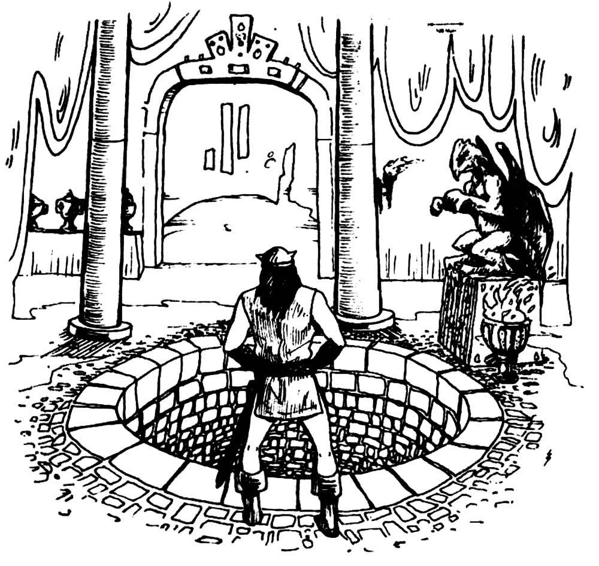

## Date
1/02/23

## Characters
- [Deekeek_Hiqui](../02_Player_Characters/Deekeek_Hiqui.md)
- [Dork_Shotazit](../02_Player_Characters/Dork_Shotazit.md)
- [Ka'Chow](../02_Player_Characters/Ka'Chow.md)
- [Pobis_Boltfull](../02_Player_Characters/Pobis_Boltfull.md)
- [Randy_Randleman](../02_Player_Characters/Randy_Randleman.md)

## Locations
- [Realmspace](../03_The_Universe/Realmspace/Index.md)
	- [Toril](Toril)
		- [Yawning Portal](../03_The_Universe/Realmspace/Toril/Waterdeep/Yawning%20Portal.md)
		- [Blue Alley](../03_The_Universe/Realmspace/Toril/Waterdeep/Blue%20Alley.md)

## NPC's
- [Durnan](../01_NPCiary/Yawning%20Portal/Durnan.md)
- [Mirt](../01_NPCiary/Yawning%20Portal/Mirt.md)

## Monster's 
- [Troll](../00_Beastiary/Minor/Troll.md)
- [Smoke Mephit](../00_Beastiary/Minor/Smoke%20Mephit.md)

## Treasure
N/A

## Log
The group of intrepid adventurers meet up in the Yawning Portal inn where they learn of a mighty treasure that could help them get back to work. After a brief fight, they are led to [Blue Alley](../03_The_Universe/Realmspace/Toril/Waterdeep/Blue%20Alley.md)

### Highlights
- The Dipping Song
- Randy almost jumping down the pit
- Ka'Chow with the catapult and Pobis shoving the troll back down the pit.

### Next Steps
To Blue Alley!

