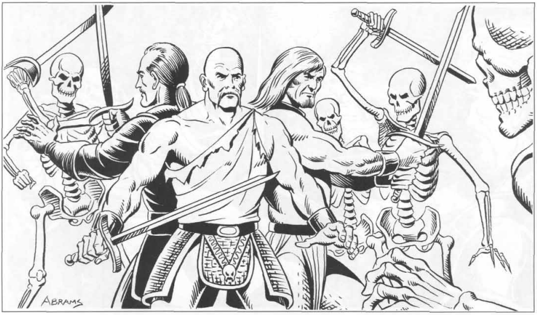

## Date
1/16/23

## Characters
- [Deekeek_Hiqui](../02_Player_Characters/Deekeek_Hiqui.md)
- [Dork_Shotazit](../02_Player_Characters/Dork_Shotazit.md)
- [Ka'Chow](../02_Player_Characters/Ka'Chow.md)
- [Pobis_Boltfull](../02_Player_Characters/Pobis_Boltfull.md)
- [Randy_Randleman](../02_Player_Characters/Randy_Randleman.md)

## Locations
- [Realmspace](../03_The_Universe/Realmspace/Index.md)
	- [Toril](Toril)
		- [Blue Alley](../03_The_Universe/Realmspace/Toril/Waterdeep/Blue%20Alley.md)

## NPC's
N/A

## Monster's 
- [Shadow Snake](../00_Beastiary/Minor/Shadow%20Snake.md)
- [Bonewheel Skeleton](../00_Beastiary/Minor/Bonewheel%20Skeleton.md)
- [Smoke Mephit](../00_Beastiary/Minor/Smoke%20Mephit.md)

## Treasure
- Moonlit Sword
- Gems
- Spelljamming Vessel 

## Log
The group of intrepid adventurers head through the treacherous Blue Alley so that they can find the Spelljamming treasure

### Highlights

### Next Steps
Lets Fly!

