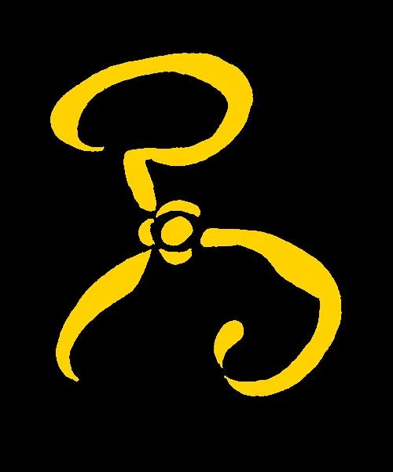

# The Yellow Sign

Along the shore the cloud waves break,
The twin suns sink behind the lake,
The shadows lengthen
In Carcosa.

Strange is the night where black stars rise,
And strange moons circle through the skies,
But stranger still is Lost Carcosa.

