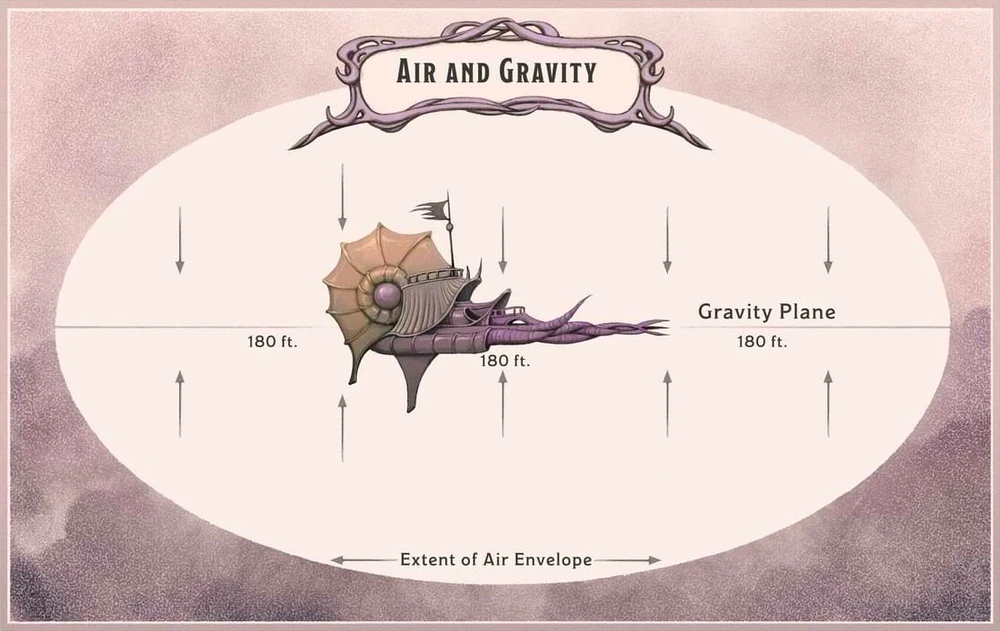

# Air and Gravity

## Air

The void of space is a vacuum, meaning there is no air to breathe, however, all objects carry with them an air envelope, which provides breathable air for some time while in the vacuum of space.

### Air Envelope by Object Size

| Size        | Air         |
| ----------- | ----------- |
| Human       | 2/d10 Turns |
| Large       | 4/d10 Turns |
| Small Ship  | 1/d4 Months |
| Large Ships | 2/d4 Months |
| Asteroids   | 3/d4 Years            |

## Gravity

In Spelljammer™,  gravity works differently from the way it works in real life. Instead of being tied to a planet's mass, gravity is produced by an object called a gravity plane. Each planet or asteroid in a crystal sphere has its own gravity plane, which extends out in all directions and affects all objects within its range. When a ship or other object enters a gravity plane, it is pulled toward the nearest point on the plane, just as if it were being attracted by a massive object. This allows ships to navigate through space, meaning that ships can travel in any direction, rather than being limited to orbiting planets as they would be in real life.

