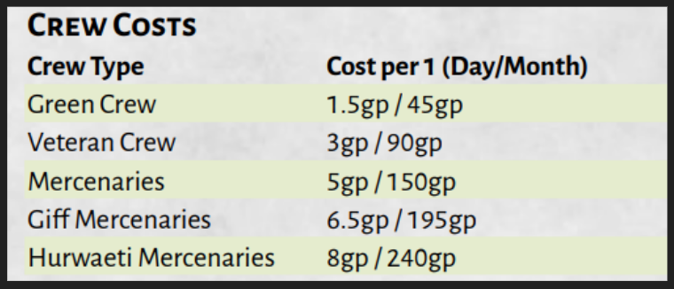

# Requirements
Spelljamming Ship

Crew

Helm

# Speed
Jamming Speed = 5 Million MPH

Tactical Speed = Automatic within 1 mile of something 1 ton

Cruising Speed = Sails up

# The Helm
Helms take on the appearance of large thrones acting as arcane conduits. 

You need 30 minutes to attune to a helm (No slot used)

Can Jam for 12 hours max or risk exhaustion - rest needed after.

When a spellcaster becomes attuned to a Helm, they are treated as that ship’s Helmsman.
Minor paralyzation; Attacks against you have advantage

When attuned - “You are the ship” Avatar kinda thing, you can deploy your senses to any part of the ship.

A ship can have more than one spelljamming helm aboard it, but only one spelljamming helm at a time can be used to control the ship. If a spelljammer tries to gain control of a ship by using a second spelljamming helm, a spelljammer duel ensues.

# The Crew
Green crew are new sailors getting their footing. They are not combat ready and basically just do their job to keep the ship moving. In combat, they will act purely in self-defense, seeking to flee and only fight if they are backed into a corner. A party can’t depend upon green crew to help in a fight or defend the ship while away.

They will upgrade to a Veteran crew after a year of sailing and then can help defend.

If needed you can hire advanced crews for boarding or fighting alongside you.

The crew uses air.

All wildjammers come with a pantry that can support the maximum crew count of the ship for 3 months without taking up cargo space

# Ship Mods / Weapons / Upgrades

# Air Envelope

# Air Quality

# Gravity

# **Maneuverability**

# Combat